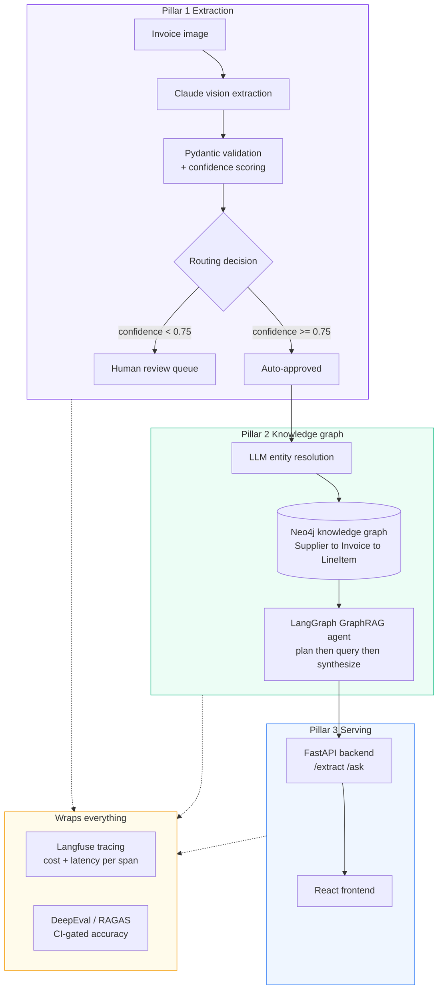
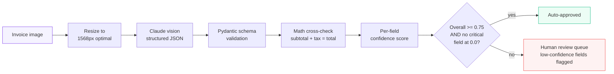
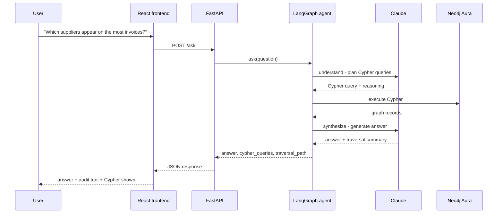
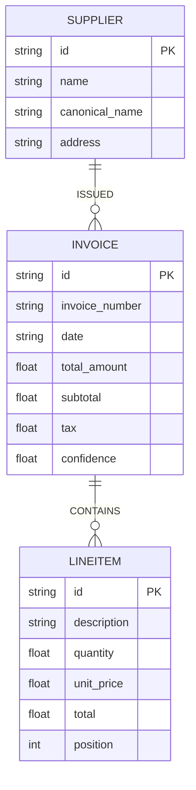

# LedgerLens

**A multimodal invoice intelligence system where the LLM cannot answer a supplier question it cannot trace back to a graph path.**

Claude reads invoice images into structured data. A knowledge graph turns that data into relationship intelligence. Every answer comes with the exact Cypher query and traversal path that produced it.

[](https://github.com/AaronFChristian/LedgerLens/blob/main/data/eval_results.json)
[](#eval-results)
[](#run-locally)
[](https://github.com/AaronFChristian/LedgerLens/blob/main/src/ledgerlens/graph)

---

## The Problem

Finance and procurement teams at mid-market firms manually key 50,000+ invoices a month at roughly $3.50 an invoice a $175,000-a-month line item that exists purely to move numbers from a PDF into a system of record. That's the visible cost.

The hidden cost is worse: even after the data is in a database, nobody can answer a question like *"which suppliers behind last month's delayed POs also had quality complaints in the past 18 months?"* Answering that means joining supplier identity, invoice history, and line-item detail across time  a multi-hop relationship question. Pure vector search retrieves similar documents; it has no concept of a graph edge, so it cannot traverse "supplier → invoice → complaint" the way the question requires.

LedgerLens closes both gaps in one pipeline: Claude vision extracts the data, a Neo4j knowledge graph encodes the relationships, and a LangGraph agent answers multi-hop questions with the graph path attached as proof.

---

## Architecture

Three pillars, wrapped by observability and evals.



### Data flow  extraction pipeline



### Sequence  ask the graph



### Graph schema



---

## How It Works

An invoice image goes in. Claude vision (`claude-sonnet-4-6`) returns structured JSON. Pydantic validates every field and cross-checks the math. A confidence score is computed per field, and anything below threshold  or any critical field extracted with zero confidence  is routed to a human review queue instead of silently auto-approving bad data.

Approved extractions go through LLM-driven entity resolution  Claude normalises "Apple Inc" / "Apple Computer" / "APPLE" into one canonical node, which is the single most common silent failure mode in GraphRAG systems. The resolved entities load into Neo4j as `Supplier → Invoice → LineItem` relationships. A LangGraph agent then answers natural-language questions by planning Cypher queries, executing them against the graph, and synthesising an answer  returning the exact query and traversal path alongside it, so every answer is auditable.

FastAPI exposes `/extract` and `/ask`. A React frontend gives non-technical users an upload box and a question box. Langfuse traces every span  extraction, entity resolution, graph query, synthesis  with token cost attached. A DeepEval/RAGAS harness scores field accuracy, groundedness, and context relevance, and gates CI so a prompt change that quietly tanks accuracy gets caught before it ships.

---

## Key Features

| Feature | Why it matters |
|---|---|
| **Multimodal extraction (Claude vision)** | Reads scanned, photographed, or faxed invoices  no OCR pre-processing step |
| **Confidence scoring + math cross-validation** | Not just field presence  checks subtotal + tax = total, flags negative/zero totals, penalises malformed dates |
| **Human-review routing** | Critical fields at zero confidence always escalate, even if the overall score looks fine  no silent bad-data approval |
| **LLM entity resolution** | Claude normalises supplier name variants before they hit the graph  the documented silent failure point of GraphRAG |
| **Neo4j knowledge graph** | `Supplier ↔ Invoice ↔ LineItem` enables multi-hop questions vector search structurally cannot answer |
| **LangGraph GraphRAG agent** | 3-state machine (understand → query_graph → synthesize) returns the Cypher and traversal path as an audit trail |
| **DeepEval / RAGAS harness, CI-gated** | Field accuracy, groundedness, and context relevance scored automatically  the hardest signal to fake in an interview |
| **Langfuse observability** | Span-level tracing across every stage with token cost per document |
| **Cost panel** | $0.009/doc vs $3.50 manual  the ROI story is on the screen, not just in the README |

---

## Tech Stack

### AI and extraction
- **Claude Sonnet (claude-sonnet-4-6)**  vision extraction, entity resolution, GraphRAG synthesis
- **Pydantic v2**  typed schemas, field validation, confidence scoring
- **Anthropic SDK**  retry with exponential backoff, structured JSON prompting

### Graph and agent
- **Neo4j Aura**  managed graph database, free tier
- **LangGraph**  stateful 3-node agent (understand → query_graph → synthesize)
- **LangChain**  agent scaffolding

### Evals and observability
- **DeepEval / RAGAS**  field accuracy, groundedness, context relevance
- **Langfuse**  span-level LLM tracing, token cost per call
- **pytest**  CI-gated accuracy thresholds

### Backend and frontend
- **FastAPI**  async REST API, CORS, file upload validation
- **React + Vite**  upload UI, ask-the-graph UI, animated processing states
- **Uvicorn**  ASGI server

### Infrastructure
- **Docker**  containerised backend
- **Fly.io / Railway**  backend deploy target
- **Vercel**  frontend deploy target
- **Python 3.12**

---

## Build Plan

### Day 1  Extraction pipeline
- Claude vision → Pydantic schema extraction with structured JSON prompting
- Per-field confidence scoring (0.0–1.0) with subtotal+tax=total cross-validation
- Human-review routing  critical fields at zero confidence always escalate
- CORD v2 dataset download + field-level accuracy evaluation
- Full offline pytest suite (25 tests, no API calls needed)

### Day 2  Knowledge graph + GraphRAG agent
- Neo4j Aura schema: `(:Supplier)-[:ISSUED]->(:Invoice)-[:CONTAINS]->(:LineItem)`
- LLM entity resolution  batched Claude call normalises all supplier name variants
- LangGraph 3-state agent: understand (plan Cypher) → query_graph (execute) → synthesize (answer)
- Every answer returns its Cypher queries and traversal path

### Day 3  Evals, observability, serving
- DeepEval/RAGAS harness: extraction accuracy + groundedness + context relevance, CI-gated at 70% threshold
- Langfuse span tracing across extraction, resolution, graph query, and synthesis
- FastAPI backend with `/extract` and `/ask`, file size limits, scoped CORS
- React frontend with animated step-by-step processing UI for both extraction and graph queries
- Docker + deploy config for Fly.io/Railway (backend) and Vercel (frontend)

---

## Eval Results

```
Total amount accuracy:     84.2%  (16/19, CORD v2 zero-shot)
Line item count accuracy:  45.0%  (9/20)
Auto-approval rate:         0.0%  (CORD receipts have no invoice numbers 
                                    correctly forces human review by design)
Cost per document:        $0.009
Manual cost baseline:     $3.50
Savings at scale:          99.7%  (10k docs/mo ~= $90 vs $35,000 manual)
```

CI gate: `total_amount accuracy >= 70%`  passing.

---

## Skill Coverage

| 2026 JD requirement | Coverage |
|---|---|
| Multimodal / vision | Core |
| GraphRAG / knowledge graphs (Neo4j) | Core |
| LangGraph / stateful agents | Core |
| Eval design / LLM-as-judge | Core |
| Observability (Langfuse) | Core |
| Structured outputs (Pydantic) | Core |
| RAG (hybrid graph + vector) | Covered |
| Prompt engineering | Covered |
| FastAPI + Docker + cloud deploy | Covered |
| CI/CD (eval-gated) | Covered |
| Cost optimisation | Covered |
| Agentic AI (tool-calling, multi-step) | Covered |

Target roles: AI Engineer · LLM Engineer · ML Engineer · Analytics Engineer

---

## Run Locally

```bash
git clone https://github.com/AaronFChristian/LedgerLens
cd LedgerLens

python3.12 -m venv .venv && source .venv/bin/activate
pip install -r requirements.txt

cp .env.example .env
# Add ANTHROPIC_API_KEY, NEO4J_URI, NEO4J_USERNAME, NEO4J_PASSWORD to .env

# Day 1 - verify extraction pipeline
pytest tests/test_extraction.py -v
python scripts/download_datasets.py
python scripts/run_eval.py --n 20

# Day 2 - build the knowledge graph
python scripts/extract_and_save.py --n 50
python scripts/load_graph.py
python scripts/ask_agent.py "Which suppliers appear on the most invoices?"

# Day 3 - run evals, then serve
pytest tests/test_evals.py -v -k "not slow"
python scripts/run_evals.py --extraction-only

# Terminal 1 - backend
PYTHONPATH=src uvicorn ledgerlens.api.main:app --reload --port 8000

# Terminal 2 - frontend
cd frontend && npm install && npm run dev
```

Open `http://localhost:3000` for the app, `http://localhost:8000/docs` for the API.

---

## Project Structure

```
LedgerLens/
├── src/ledgerlens/
│   ├── extraction/       Claude vision pipeline, schemas, confidence scoring
│   ├── graph/             Neo4j client, entity resolution, graph loader
│   ├── agent/             LangGraph GraphRAG agent
│   ├── evals/              DeepEval/RAGAS harness, Langfuse tracing
│   ├── api/                FastAPI backend
│   └── config.py           Centralised settings
├── frontend/               React + Vite upload and ask-the-graph UI
├── scripts/                 Dataset download, extraction, graph load, eval runners
├── tests/                    pytest suite (offline unit + CI-gated integration)
├── data/                       CORD v2 samples, extraction results (gitignored)
├── Dockerfile
├── fly.toml
└── README.md
```

---

## Production Checklist

Built for portfolio demonstration. Before production use:

- [ ] Add API key authentication to all endpoints
- [ ] Replace in-memory cost counters with persistent storage
- [ ] Add Neo4j connection pooling
- [ ] Add request rate limiting per client
- [ ] Cache repeated graph queries
- [ ] Pin all dependency versions (`pip freeze > requirements.txt`)
- [ ] Add structured logging to a log aggregator
- [ ] Add invoice deduplication before extraction

---

**Cold-outreach hook:** *"I built a service that reads an invoice image into clean structured data and answers 'which suppliers behind last month's delayed POs also had quality issues'  with the full audit trail  using a knowledge graph instead of brittle vector search."*
